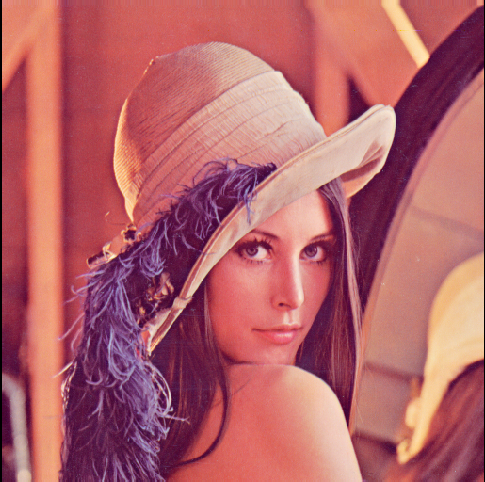
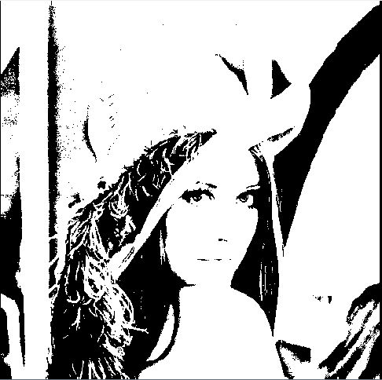
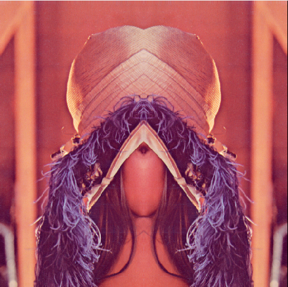
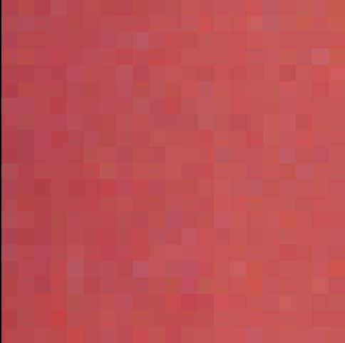

# Editor de Fotos 

 Editor de fotos desenvolvido usando c++ como projeto final da disciplina de Linguagem de Programação da UFRN. Ele funciona apenas com arquivos do formato ".ppm" e tem as seguintes opções de edição:

- Binarizar
- Refletir
- Borrar
- Cortar

## Funcionamento:

 O script ao ser executado ele pergunta qual tipo de edição você deseja realizar e pede que seja passado o nome do arquivo que deve ser editado. Feito isso, ele irá pegar o arquivo, ler a matriz proveniente da imagem em questão e em cima disso, trabalhar com os valores dos pixels das imagens. Sendo pra cada tipo de edição, uma função diferente é chamada e uma lógica diferente é aplicada para manipular o valor dos pixels. 

 &nbsp;&nbsp;&nbsp;&nbsp;   

 (Imagem usada para testar o código e a matriz dos pixels correspondente ao arquivo de imagem ".ppm")

## Efeitos do Editor:

### Binarizar:

Passando um limiar de 70

### Refletir:

### Borrar:

### Cortar:

Passando os seguintes valores (linha inicial, linha final, coluna inicial e coluna final): 30 50 100 120 

